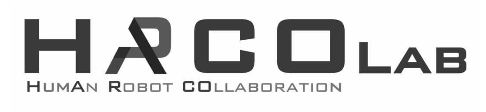

<h1 class="animate__animated animate__lightSpeedInRight"></h1>

Welcome to the <b>HumAn-Robot COllaboration (HARCO)</b> Research Lab!  
Our research interests include
Physical Human-Robot Interaction (pHRI), 
Human-Robot Collaboration, Shared Control, 
Whole-body Control,
Ergonomics, Human Modeling, Feedback Devices,  
Powered Exoskeleton Robots.
 
 

We are currently looking for Post-docs, PhD candidates, and engineers who are passionate about solving problems in the fields of Exoskeleton Robots and Collaborative Robots (Cobots).
 
 
 

If you are interested in joining our team, please send your CV to:
<a href='mailto:wansookim@hanyang.ac.kr'>wansookim@hanyang.ac.kr</a>

***




{:.center}

